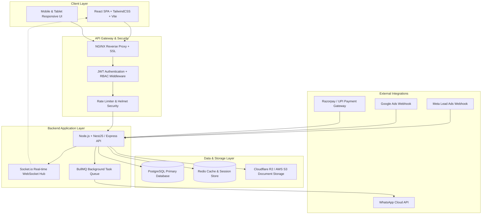
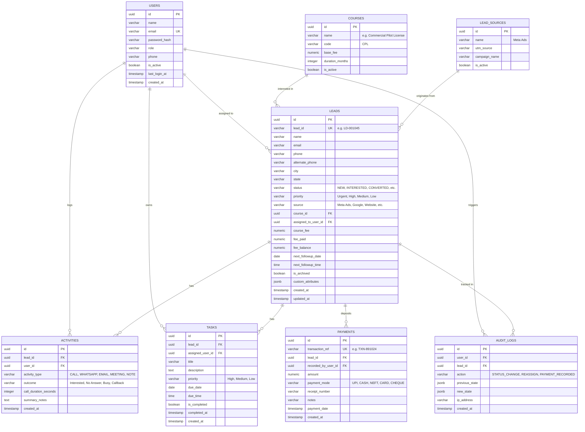

# AEERO CRM — Complete System Architecture & Tech Stack Guide
> **Comprehensive Production Blueprint for Frontend, Backend, Database, and Cloud Infrastructure**

---

## 📌 Executive Summary
AEERO Lead Management CRM is a specialized Aviation Academy CRM designed for high-velocity prospective student inquiry handling, multi-channel marketing attribution, counselor productivity tracking, automated communication dispatch, fee payment recording, and executive reporting.

This document outlines the **recommended production technology stack**, **database schema**, **API architecture**, and **implementation rationale** for scaling the CRM to 1,000,000+ leads, hundreds of concurrent counselors, and instant multi-channel lead ingestion.

---



---

## 🖥️ 1. Frontend Architecture & Recommendations

### 1.1 Tech Stack Selection

| Technology | Category | Why Use It? |
| :--- | :--- | :--- |
| **React 18 / 19** | UI Framework | Component-based modularity, virtual DOM speed, ecosystem maturity, seamless SPA rendering. |
| **Vite** | Build Tool & Dev Server | Ultra-fast Hot Module Replacement (HMR < 50ms), optimized Rollup production bundling, ES modules support. |
| **TailwindCSS v3 / v4** | CSS Framework | Utility-first rapid styling, zero dead CSS in production, flexible dark/light theme switching without runtime overhead. |
| **Lucide React & Material Symbols** | Iconography | Crisp vector icons for aviation courses, counseling states, status badges, and communication touchpoints. |
| **TanStack Query (React Query)** | Server State & Cache | Auto-caching, background re-fetching, optimistic UI updates for lead stage drag-and-drop, zero loading lag. |
| **Zustand** | Client State Management | Minimal lightweight state store (< 1kB) for session user, active dark/light theme, column visibility, and active filters. |
| **Chart.js / Recharts** | Data Visualizations | Responsive interactive area trends, funnel pipelines, source donuts, and counselor performance graphs. |

### 1.2 Recommended Frontend Directory Structure
```
frontend/
├── public/
│   ├── favicon.ico
│   └── aeero-logo.png
├── src/
│   ├── api/                 # Axios / Fetch client with auto JWT refresh interceptors
│   │   ├── client.js
│   │   ├── leads.api.js
│   │   └── stats.api.js
│   ├── assets/              # Static icons, flight simulator illustrations
│   ├── components/          # Reusable UI components
│   │   ├── common/          # Buttons, Badges, Modals, Inputs, Dropdowns
│   │   ├── layout/          # Header, Sidebar, BottomNav, PageContainer
│   │   └── charts/          # FunnelChart, TrendAreaChart, SourceDonut
│   ├── context/             # ThemeContext, AuthContext, SocketContext
│   ├── hooks/               # useLeads, useDebounce, useAutoRefresh, useSocket
│   ├── pages/               # Route Views (Dashboard, AllLeads, Kanban, Calendar, etc.)
│   ├── store/               # Zustand state stores (authStore, filterStore)
│   ├── types/               # TypeScript interface schemas (Lead, Task, User, Payment)
│   ├── utils/               # Date formatters, currency INR parser, CSV exporter
│   ├── App.jsx
│   ├── index.css            # Dark Reader + Light Mode Theme Variables
│   └── main.jsx
├── tailwind.config.js
└── vite.config.js
```

---

## ⚙️ 2. Backend Architecture & Recommendations

### 2.1 Tech Stack Selection

| Technology | Category | Why Use It? |
| :--- | :--- | :--- |
| **Node.js (LTS)** | Runtime | High-throughput asynchronous event-driven I/O ideal for thousands of incoming ad inquiries. |
| **NestJS (or Express + TS)** | API Framework | Enterprise architectural patterns (Controllers ➔ Services ➔ Repositories), Dependency Injection, built-in validation. |
| **TypeScript** | Language | End-to-end type safety, eliminating runtime `undefined` bugs across leads, payments, and activity records. |
| **Prisma ORM / Drizzle** | Database ORM | Auto-generated type-safe database queries, declarative migrations, connection pooling, fast SQL execution. |
| **Socket.io** | WebSockets | Real-time bi-directional events (new lead popups, task completion sync, lead collision avoidance). |
| **BullMQ + Redis** | Background Queue | Delayed callback reminders, automated brochure dispatch, cron job processing without blocking main thread. |
| **Zod / class-validator** | Validation | Strict schema validation preventing invalid phone numbers, malicious payload injections, and duplicate emails. |
| **Helmet + CORS + RateLimit**| Security | HTTP security headers, CORS origin whitelisting, API brute-force protection (100 reqs/min per IP). |

### 2.2 Core Security & Role-Based Access (RBAC) Matrix

| User Role | View All Leads | Edit / Move Stages | Reassign Leads | Record Payments | Delete / Archive | Access Reports & Settings |
| :--- | :---: | :---: | :---: | :---: | :---: | :---: |
| **Super Admin** | ✅ | ✅ | ✅ | ✅ | ✅ | ✅ |
| **Branch Manager** | ✅ | ✅ | ✅ | ✅ | ❌ | ✅ |
| **Senior Counselor**| ✅ (Assigned + Team) | ✅ | ❌ | ✅ | ❌ | ❌ |
| **Tele-Counselor** | ❌ (Own Assigned Only)| ✅ | ❌ | ❌ | ❌ | ❌ |
| **Marketing / Lead Finder** | ✅ (Read Only) | ❌ | ❌ | ❌ | ❌ | ✅ (Sources Only) |
| **Accountant** | ❌ (View Payments Only)| ❌ | ❌ | ✅ | ❌ | ✅ (Revenue Only) |

---

## 🗄️ 3. Database Architecture & Schema Design (PostgreSQL)

### 3.1 Why PostgreSQL?
1. **Relational Integrity**: Strict foreign keys guarantee that an activity, payment, or follow-up is never orphaned if a lead exists.
2. **ACID Transactions**: When recording a course fee payment, student balance update, invoice generation, and audit logging happen atomically (all succeed or all rollback).
3. **High Performance Indexing**: Multi-column composite indexes and B-Tree indexes allow searching across 1,000,000+ leads in < 15 milliseconds.
4. **JSONB Hybrid Support**: Allows storing custom dynamic aviation metadata (e.g. Flight Medical Class 1/2 status, Passport validity, Simulator slots) without altering core SQL tables.

---

### 3.2 Complete PostgreSQL Entity-Relationship (ER) Schema



---

## ⚡ 4. Caching, Queue & Real-time Integration

### 4.1 Redis Caching Strategy
- **Dashboard Summary Cache**: Store computed results of `/api/stats` with a 60-second TTL (`stats:overview:today`).
- **Counselor Online Status**: Redis sets tracking live counselors for automated round-robin lead routing.
- **Rate-Limiting Token Buckets**: Prevent API abuse from public forms and scrapers.

### 4.2 BullMQ Background Jobs
1. **`lead-welcome-dispatcher`**:
   - Triggers when a new lead is inserted.
   - Automatically sends an official AEERO Academy Welcome WhatsApp message + Syllabus PDF.
2. **`callback-reminder-worker`**:
   - Runs every 5 minutes.
   - Queries callbacks scheduled for the next 15 minutes and sends push notification + WebSocket alert to assigned counselor.
3. **`overdue-status-updater`**:
   - Runs every night at 12:01 AM.
   - Flags all uncompleted past follow-up tasks as `OVERDUE`.

---

## ☁️ 5. Storage & Cloud Infrastructure

| Infrastructure Layer | Recommended Service | Functionality |
| :--- | :--- | :--- |
| **App Hosting** | AWS EC2 / DigitalOcean Droplet / Hetzner | Hosts Docker containers for Backend API and Redis. |
| **Frontend CDN** | Cloudflare Pages / Vercel / AWS S3 + CloudFront | Ultra-fast global edge caching of compiled static HTML/JS/CSS. |
| **Managed Database** | AWS RDS PostgreSQL / Supabase / DigitalOcean DB | Automatic daily backups, read replicas, 99.99% high availability. |
| **Object Storage** | Cloudflare R2 / AWS S3 | Stores student enrollment documents, ID proofs, payment slips (Zero egress fees with Cloudflare R2). |
| **Process Manager** | PM2 or Docker Compose | Auto-restarts Node.js processes on crash, cluster mode load balancing across CPU cores. |
| **SSL & DNS** | Cloudflare DNS + Free Managed SSL | DDoS protection, automated HTTPS encryption, global DNS routing. |

---

## 🔄 6. External Webhooks & API Ingestion Flow

### 6.1 Meta Ads (Facebook & Instagram) Direct Ingestion
```
[Student submits Facebook Lead Form]
                  │
                  ▼ (Instant Webhook POST)
[Meta Graph Webhook: /api/webhooks/meta-lead]
                  │
                  ▼
[Verify Meta SHA256 Signature & Token]
                  │
                  ▼
[Check Duplicate Phone / Email in PostgreSQL]
        ├── If Found: Append as Activity Touchpoint
        └── If New:   Insert Lead ➔ Auto-Assign via Round-Robin
                  │
                  ▼
[Emit Socket.io Event to Counselor Workspace]
                  │
                  ▼
[Queue BullMQ Job: Send Instant WhatsApp Brochure]
```

---

## 🚀 7. Recommended Implementation Roadmap

1. **Phase 1 (Database & ORM Setup)**:
   - Initialize PostgreSQL database.
   - Write Prisma schema and run initial migrations (`npx prisma migrate dev`).
   - Populate default admin users, aviation courses (`CPL`, `AME`, `Cabin Crew`, `Industrial Safety`), and lead sources.

2. **Phase 2 (Core REST API & Auth)**:
   - Implement JWT authentication, password hashing (`bcrypt`), and RBAC middleware.
   - Build CRUD endpoints for Leads, Activities, Tasks, Payments, and Stats.

3. **Phase 3 (Real-Time WebSockets & Meta Webhooks)**:
   - Configure Socket.io server for live lead alerts and counselor task synchronization.
   - Setup Meta Lead Ads and WhatsApp Cloud API webhook listeners.

4. **Phase 4 (Frontend Connect & Optimization)**:
   - Connect React UI components to backend endpoints via TanStack Query.
   - Implement Dark Reader / Light theme persistence, live search debouncing, and export handlers.

5. **Phase 5 (Production Deployment & Monitoring)**:
   - Deploy Docker containers behind NGINX with SSL.
   - Setup automated daily database backups and uptime health checks.
